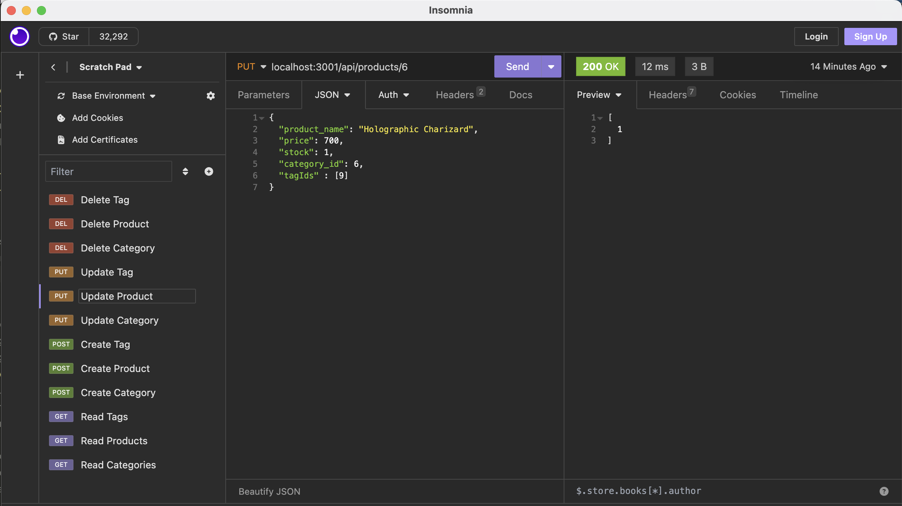

# e-commerce-back-end 

Back end development for an e-commerce website. 

## Description:
This setup enables the backend routes for an e-commerce website to add new products, categories and tags to their database. It uses expressJS and express routers so set up the API endpoints that modify the SQL database using sequilize. 

This is a exercise in using sequilize with SQL and node.js for object relational mapping.  

## Table of Contents:
  - [Installation](#installation)
  - [Usage](#usage)
  - [Demonstration](#demonstration)
  - [License](#license)

## Installation:
This application requires using express, sequilize, and mySQL2, use "npm i" to install the required dependencies. You can also seed the database to begin with our seeds.sql files using the command "npm run seed" 

## Usage:
Invoke the express server with "node server.js". It will then allow you to send Read, Create, Update, and Delete requests to the available routes.   

## Demonstration:
[Here is a video demonstration of my application](https://drive.google.com/file/d/1FF2ldrJMYF1dmnvlftoKoNbggUsHE8yB/view)

## License:
-[MIT](https://opensource.org/license/mit/) 

### Enjoy!
